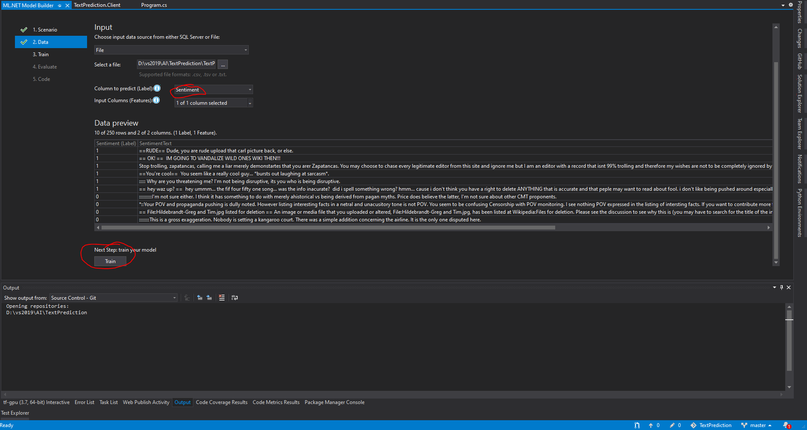

# ML.NET TextPrediction

## Sentiment Analisys Model

This example demonstrates from zero how to train, evaluate and generate the necessary code to predict a Sentiment analyzer.

I've used the [Model Builder](http://link.enigma-mx.com/4ABS) of Microsoft [ML.NET](http://link.enigma-mx.com/4ABT).

### IMPORTANT
Here you can download the [Dataset File](TextPrediction.Client/SentimentAnalysis.tsv).

In this example is used the Official [Wikipedia Detox](https://meta.wikimedia.org/wiki/Research:Detox) dataset.

This dataset is provided under [CC0](https://creativecommons.org/share-your-work/public-domain/cc0/). Redistributing the dataset "wikipedia-detox-250-line-data.tsv" with attribution:
Wulczyn, Ellery; Thain, Nithum; Dixon, Lucas (2016): Wikipedia Detox. figshare.
With modifications by taking a sample of rows and reducing rough language.

### Instructions / Steps
Right Click on Proyect under Solution > Add > Machine Learning.

Click on Sentiment Analysis.

 
 

Select File > Your TSV Path > Open.

 

Select "Sentiment" as Column to Predict and "SentimentText" as Input Column > Click Train.

 

Change as you wish the training Time > Click on Start training > See the results on your Output View.

If all is good Click on Evaluate.

 

Change the SentimentText Label if you wish > Click on Predict > See the results.

If it's OK just Click on Code.

 

Click on Add Projects Button.

 

As you can see there's two projects added to your solution.

 

Go to TextPrediction.Client Properties > under Build Section change the "Platform Target" to "x64" > Save All.

 

Add on TextPrediction.Client the reference to TextPredictionML.Model project.

Add those lines of code on Main Method.

 

Debug your application and write some text > Hit enter > See Results on screen.

 
 
 

### Related Links

 